# CS_106-B 作业

##  1. <a name='-0'></a>目录

<!-- vscode-markdown-toc -->
* 1. [目录](#-0)
* 2. [assign0](#assign0)
* 3. [assign1](#assign1)
	* 3.1. [第一部分 完全数](#-1)
	* 3.2. [第二部分 姓氏编码检索程序](#-2)
* 4. [assign2](#assign2)
* 5. [assign3.1](#assign3.1)
* 6. [assign3.2](#assign3.2)
* 7. [assign4](#assign4)
* 8. [assign5](#assign5)

<!-- vscode-markdown-toc-config
	numbering=true
	autoSave=true
	/vscode-markdown-toc-config -->
<!-- /vscode-markdown-toc -->

##  2. <a name='assign0'></a>assign0
***1. assign0-0***

- 包含名字的散列值结果：

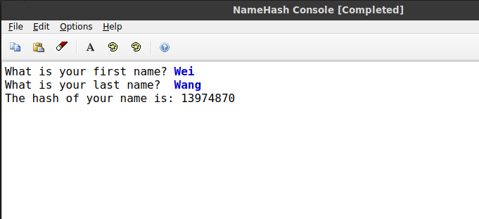

***2. assign0-1***
- 调试练习文档中的一个中间值结果：

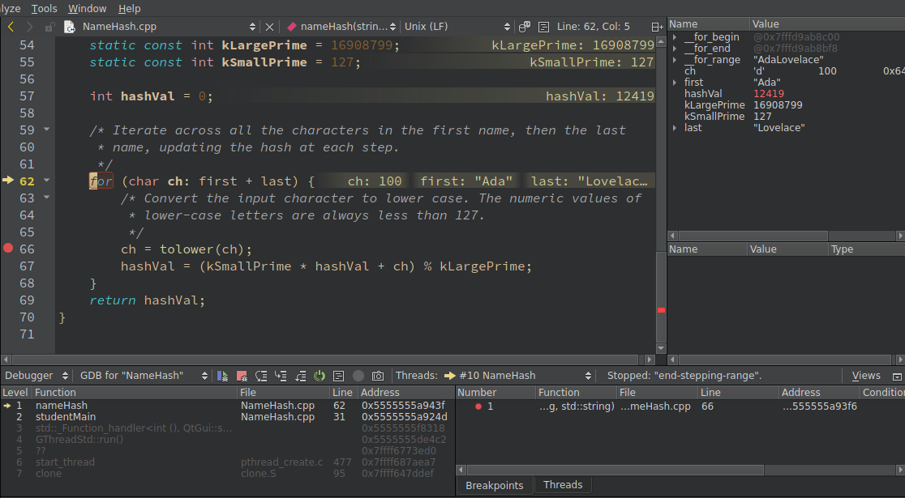

##  3. <a name='assign1'></a>assign1

###  3.1. <a name='-1'></a>第一部分 完全数

***1. Q1***

- 通过``<time.h>``库中的``time()``函数进行计时，得到程序的执行时间为10.0195秒，运行结果截图如下：

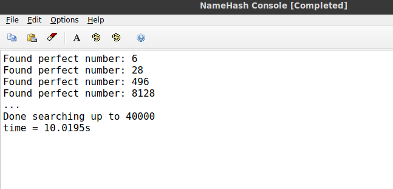

- 1 到 40000 内共有 4 个完全数，分别是 6，28，496，8128。

***2. Q2***

- ``findPerfects()``的执行时间如下表所示：
  
  |搜索范围 |执行时间(s)|
  |---------|----------|
  |10000|0.645|
  |20000|2.479|
  |40000|9.949|
  |50000|15.431|
  |60000|22.006|
  |80000|39.119|
  |110000|73.753|

- ``findPerfects()``的测试截图如下

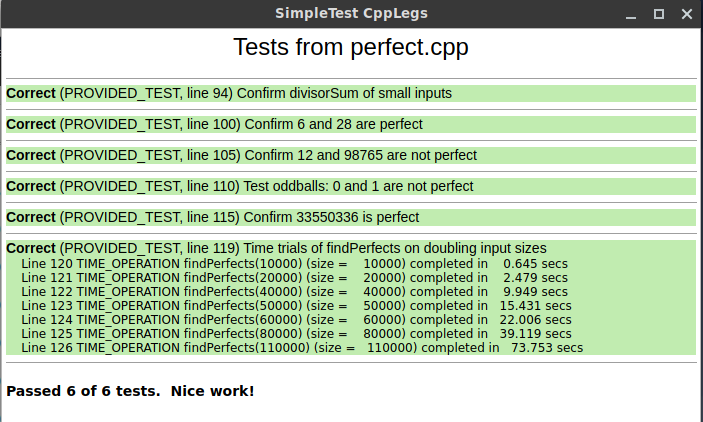

- 根据数据量大小以及其执行时间，画出两者间的函数图像如下，可以看到执行时间与搜索数据量大小的平方近似成正比。

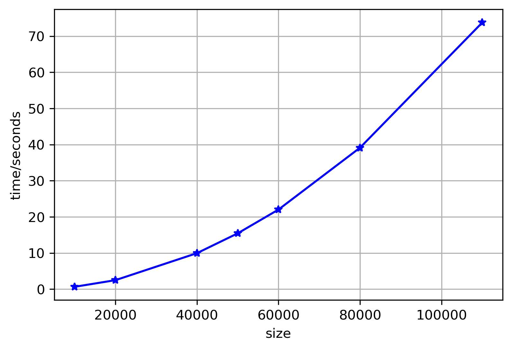

***3. Q3***

- 对于 10 与 1000，计算 ``isPerfect``做的工作不是同样多的。如果n=10，则``isPerfect``中调用的``divisorSum(n)``中的for循环仅仅循环1次，如果n=1000，则``isPerfect``中调用的``divisorSum(n)``中的for循环会循环1000，n=1000的工作量更大。

- 对于搜索范围为 1-1000 的数，``findPerfect``调用的``divisorSum``中的for循环共循环$\frac{(1+1000)*1000}{2}=500500$次，搜索范围为1000-2000的数，``findPerfect``调用的``divisorSum``中的for循环共循环$\frac{(1000+2000)*10010}{2}=1501500$次，搜索范围为1000-2000的数时，``findPerfect``的工作量更大。

***4. Q4***

- 由于花费时间与完全数的平方成正比，第5个完全数是33550336，结合之前程序搜索110000以内的完全数需要73.753秒，所以``findPerfect``找出第5个完全数要花费的时间为
$\frac{33550336^2}{110000^2}*73.753=6.861*10^6 秒 = 79.410 天$。

***5. Q5***

- 这个函数测试失败时，部分测试能通过，部分测试不能通过。原先完全数成立的测试不能通过，而原先完全数不成立的测试依旧能通过测试。

- 测试通过结果如下图所示：

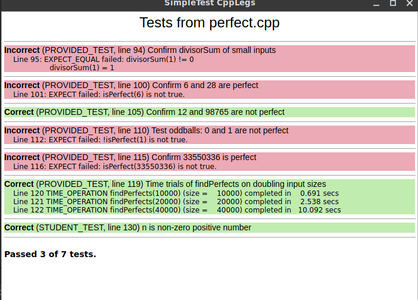

***6. Q6***

- 测试策略: 首先对``divisorSum()``的已有的案例进行测试，之后针对``smarterSum()``添加新的特殊的案例，例如输入的n是某个数的平方。

***7. Q7***

  - ``findPerfectsSmarter``的执行时间如下表所示：

|搜索范围|执行时间(s)|
|--------|----------|
|375000|3.114|
|750000|8.599|
|1500000|24.080|
|3000000|67.649|

- ``findPerfectsSmarter``的测试结果截图如下：

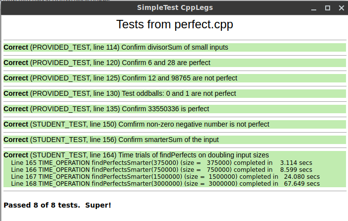

***8. Q8***

- 由于花费时间与$n\sqrt{n}$成正比关系，第5个完全数是33550336，结合之前程序搜索3000000以内的完全数需要67.649秒，所以ffindPerfectsSmarter找出第5个完全数要花费的时间为
$\frac{33550336*\sqrt{33550336}}{3000000*\sqrt{3000000}}*67.649=2156.032 秒= 35.934 分$。

***9. Q9***

- 通过``EXPEXT_EQUAL``测试方法判断``findNthPerfectEuclid()``返回的前5个完全数是否等于已有完全数表中对应的数值。

- ``findNthPerfectEuclid()``函数的测试截图如下：
  
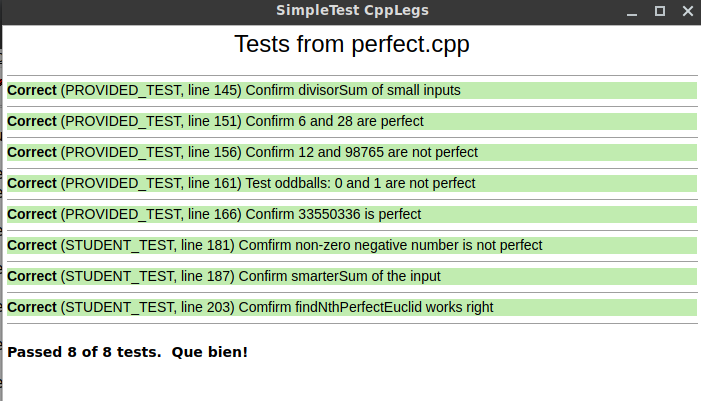

###  3.2. <a name='-2'></a>第二部分 姓氏编码检索程序

***10. Q10***

- "Angelou" 的编码是A524，编码计算过程如下:

Angelou -> 0520400 -> 052040 -> A52040 -> A524

***11. Q11***

- 分解为如下过程：
  1. 去除非字母字符;
  2. 进行编码;
  3. 去除相邻重复数字;
  4. 用首字母替换第一个数字;
  5. 删除0;
  6. 将编码格式化为4个字符。

***12. 添加测试暴露removeNonLetters()的bug***
- 添加一条测试案例，并暴露出函数``removeNonLetters``的 bug的截图：
  
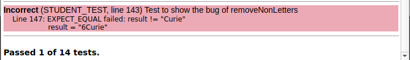


***13. 实现soundex()***

- 实现``soundex()``后的测试截图如下：

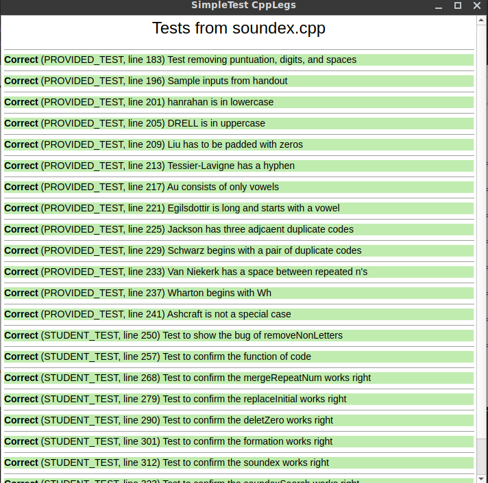

***14. 实现soundexSearch()***

- 实现``soundexSearch()``后的运行结果截图如下：

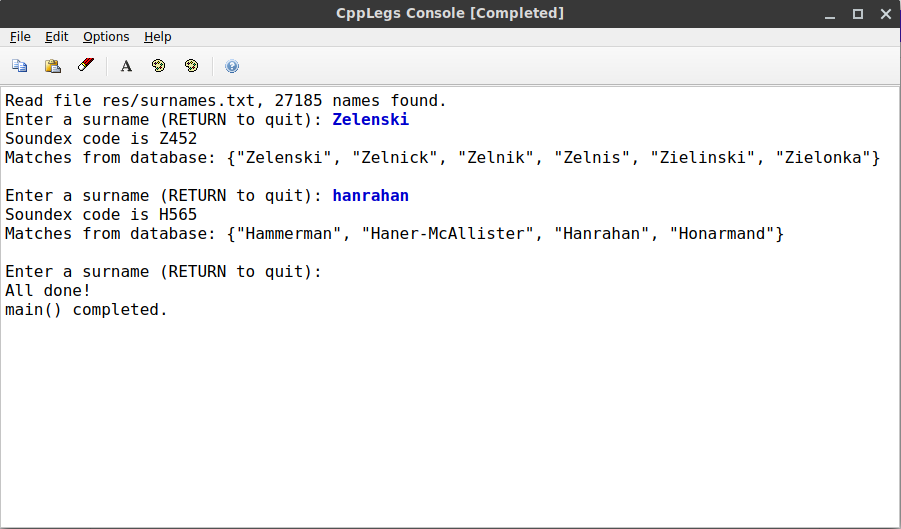

##  4. <a name='assign2'></a>assign2

***1. Q1***

- 当 Stack 仅包含一个元素时，这两个标签将显示为“bottom/top”，如下图中变量区所示:

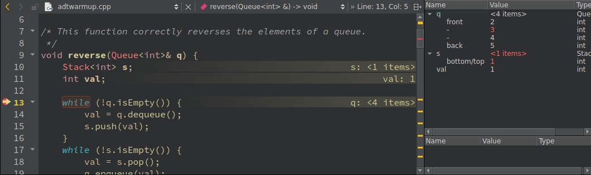

***2. Q2***

- 这种情况是由于``duplicateNegatives()``函数中``for``循环的判断语句不当造成的，因为程序执行过程中如果队列顶部的元素是负数的情况下队列会增大，导致``for``循环不能及时停止，且当``duplicateNegatives()``函数的输入队列q中的所有元素都是负数的情况下是无限循环，只要队列``q``中含有正的元素，程序的终究会停止，并不是正真的无限循环，所以程序是否会陷入无限循环和队列中负值的位置的关系不大（当``q``中元素个数很小的情况下会受到位置的影响）。``duplicateNegatives``中的``for``循环下标``i``每循环1次都会递增1，每次循环中如果``q``顶部的元素是负数的情况下，``q.size()``才会递增1，``q``顶部的元素是正数的情况下，``q.size()``保持不变。这样每当``q``顶部的元素是正数的情况下，循环下标``i``与``q`.size()``的差距就会减小1，最终程序总会停止，并不是真的无限循环，只不过循环的时间长短和q中的负数元素与正数元素的个数相关，而且由于``q``顶部的元素是负数的情况下，``q``中负数元素的个数都会增加1个，导致``q``中负数的个数会逐渐翻倍，导致``q``顶部遇到的正元素所经过的时间会翻倍，循环下标``i``与``q.size()``的差距就会减小1所消耗的时间就会曾长。

***3. Q3***

- 因为程序执行过程中如果队列顶部的元素是负数的情况下队列会增大，所以专门用一个变量存储队列q最初所含元素的个数即可避免bug。修复bug后的测试截图如下：

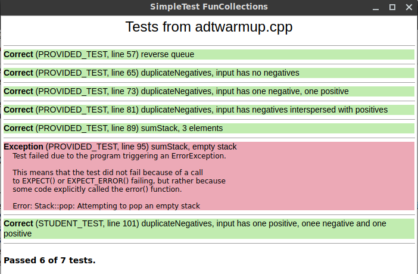

***4. Q4***

- ``sumStack``函数在``while``循环中已经对``s``是否为空进行了判断，所以没必要在函数最初对栈进行弹出操作，为不影响计算结果，直接将变量``total``初始化为0即可。

***5. Q5***

- 因为``validatePath``函数中需要对``path``进行遍历来判断路径中是符合移动规则，而``path``是个栈，除了``pop``没有其他方法可以对其进行遍历，而``pop``方法会修改``path``中的内容，如果使用引用方式传递参数的话会使得原始变量被修改，从而对后续的代码产生影响，``validatePath``函数的测试截图如下：

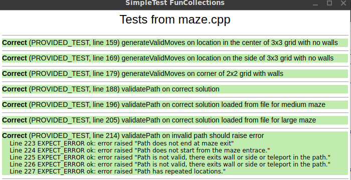

***6. Q7***

- index的内容如下：

```
{
  "5lb_m&ms":{"www.shoppinglist.com"}, 
  "blue":{"www.dr.seuss.net", "www.rainbow.org"}, 
  "bread":{"www.shoppinglist.com"}, 
  "eat":{"www.bigbadwolf.com"}, 
  "fish":{"www.bigbadwolf.com", "www.dr.seuss.net", "www.shoppinglist.com"}, 
  "green":{"www.rainbow.org"}, 
  "i":{"www.bigbadwolf.com"}, 
  "milk":{"www.shoppinglist.com"}, 
  "one":{"www.dr.seuss.net"}, 
  "red":{"www.dr.seuss.net", "www.rainbow.org"}, 
  "two":{"www.dr.seuss.net"}
}
```

***7. maze测试及运行截图***

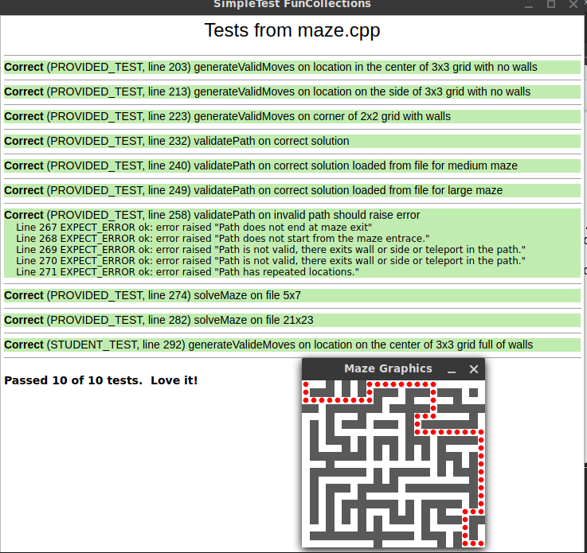

***8. searchEngine运行截图***

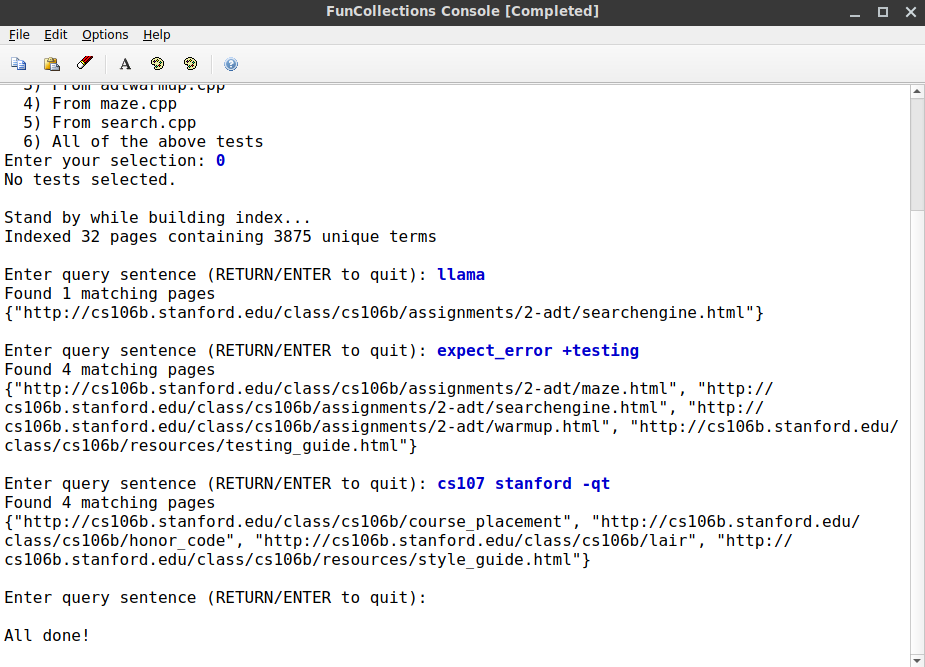

##  5. <a name='assign3.1'></a>assign3.1

###  第一部分 递归基础热身

***1. Q1***

函数调用栈中的函数名称相同，说明函数调用了自身，即程序使用了递归。

***2. Q2***

level2级别的调用栈帧截图如下
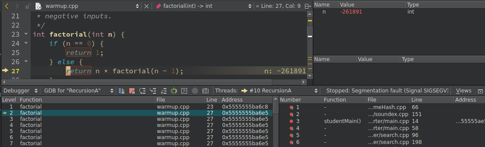

level2级别调用栈中的n值为-261891，最外层调用函数时n值为-3，所以最多可以使用的栈帧数为-3-（-261891）=261888。

***3. Q3***

无限递归与无限循环症状的不同：无限循环由于大多数情况下不会创建新的栈，所以症状是程序会持续运行下去，不会自动停止。无限递归在递归过程中持续创建新的栈，虽然程序也会持续运行一段时间，但是当栈帧数达到系统上限时程序会崩溃并停止。

***4. Q4***

base 和 exp 导致测试失败的情况如下：

- base是负数，且exp是负数或者大于2的情况；

- base等于0，且exp是负数的情况。

***5. Q5***

base是负数对应的case是多余的，与最后的case重复，且处理过程是错误的。

***6. warmup测试截图***

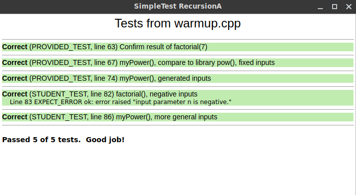


### 第二部分 符号配对

***7. Q6***

个人认为迭代版本更容易阅读和理解，递归版本更容易确认正确的行为。

***8. balanced测试截图***

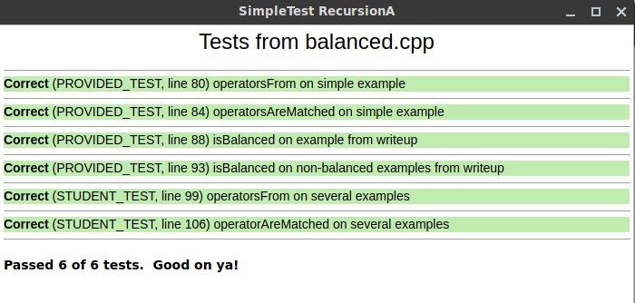

### 第三部分 Sierpinski 分形

***9. sierpinski运行截图***

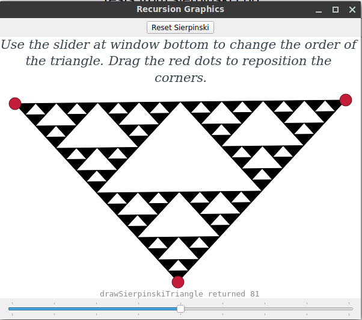

### 第四部分 合并有序序列

***10. Q7***

可以合并的最大序列的长度近似和系统支持的最大栈帧数近似相等，由Q2可知近似是260000。

***11. Q8***

如果试图递归合并一个大于最大值的序列，程序将会崩溃并停止。

***12. merge测试截图***

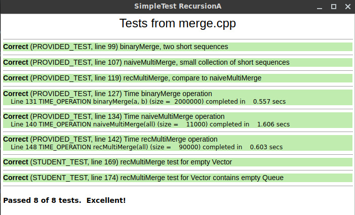

##  6. <a name='assign3.2'></a>assign3.2

### 第一部分 递归回溯热身

***1. Q16***

在 ``hanoiAnimation`` 中越过 ``moveTower`` 调用之后，``totalMoves`` 的值是15，运行截图如下。

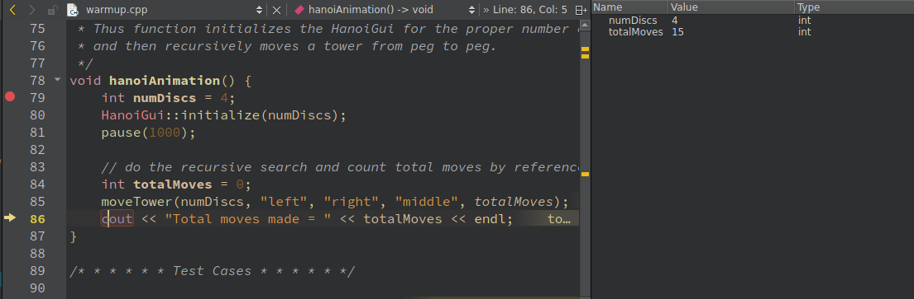

***2. Q17***

在 Step Over 第一个递归子调用之后，``totalMoves`` 变量的值是7，运行截图如下。

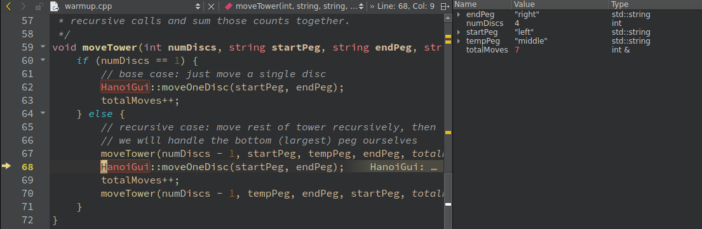

***3.Q18***

在 ``moveTower`` 的 Base Case 满足时选择 Step Out，你最终会在函数 ``moveTower`` 中，行号是67，此时，``totalMoves`` 变量的值是1，运行截图如下。

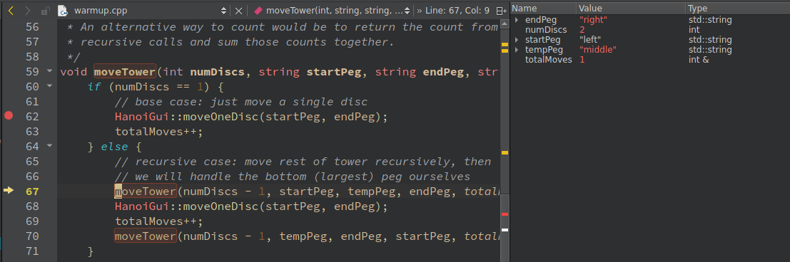

***4. Q19***

我用来触发程序错误的最小可能输入是仅包含1个元素的``Vector<int>``变量``{3}``。

***5. Q20***

include递归分支中使用的 += 赋值运算符修改了``sumSoFar``的数值，exclude递归分支运行过程中使用了被修改的``sumSoFar``变量，导致运行结果不符合预期值。

### 第二部分 拼字游戏

***6. boggle测试截图***

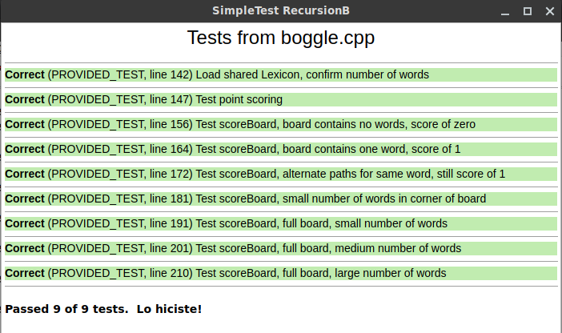

### 第三部分 投票系统

***7. Q21***

btr和dfs版本的``computerPowerIndex``的复杂度都是O(n\*2^n)，``computerPowerIndex``依次对``Vector``中的每个元素调用递归函数，循环的复杂度为O(n)，而递归函数的调用都用引用降低复杂度为O(1),且递归调用次数都是2^n，所以``computerPowerIndex``的复杂度是O(n\*2^n)

***8. Q22***

本地运行27个选票的关键选票的时间为23s，由于计算时间与n\*2^n成正比，所以含有51个选票的关键选票计算时间为(51\*2^51) \* 23s / (27\*2^27)，约等于2^29s

***9. voting测试截图***

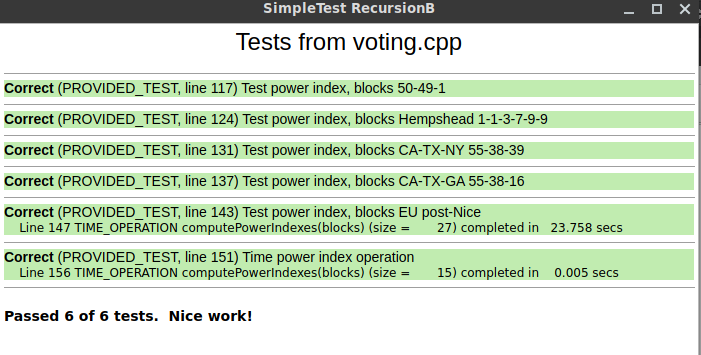

##  2. <a name='assign4'></a>assign4

### 第一部分 热身

***1. Q1***

``allBalls[0]`` 成员变量的值在迭代中的变化如下:``_id``、``_vx``、``_vy``保持不变、``_x``在之前数值的基础上变化``_vx`` ，``_y`` 之前数值的基础上变化``_vy``。

***2. Q2***

在随机数种子设定为2000的条件下，``_id``为2的小球卡在窗口的右侧，循环过程中``_id``保持不变，``_vx``在1和-1之间来回切换，``_vy``保持不变、``_x``在之前数值的基础上变化``_vx``，``_y`` 之前数值的基础上变化``_vy``。

***3. Q3***

强制把卡住的球放置到 (0, 0) 位置会恢复正常。

***4. Q4***

在我的系统上，这些内存错误的观察结果如下：

- 访问分配的数组边界之外的索引 

有时能正常运行，有时会报以下错误
```
[SimpleTest] starting (PROVIDED_TEST, line  44) Test case that access indexes ... 
*** STANFORD C++ LIBRARY
*** The PQueue program has terminated unexpectedly (crashed)
*** A segmentation fault (SIGSEGV) occurred during program execution

    This error indicates your program attempted to dereference a pointer
    to an invalid memory address (possibly out of bounds, deallocated, nullptr, ...)

*** To get more information about a program crash,
*** run your program again under the debugger.

FATAL: exception not rethrown
```

- 两次删除相同的内存

```
[SimpleTest] starting (PROVIDED_TEST, line  60) Test case that deletes same me... 
*** STANFORD C++ LIBRARY
*** The PQueue program has terminated unexpectedly (crashed)
*** A segmentation fault (SIGSEGV) occurred during program execution

    This error indicates your program attempted to dereference a pointer
    to an invalid memory address (possibly out of bounds, deallocated, nullptr, ...)

*** To get more information about a program crash,
*** run your program again under the debugger.

FATAL: exception not rethrown
```

- 删除后访问内存

``EXPECT_EQUAL``测试没有通过，内存释放后``taskList[0].label``中的变量不再是字符串``"sleep"``，调试过程中变量区截图如下。

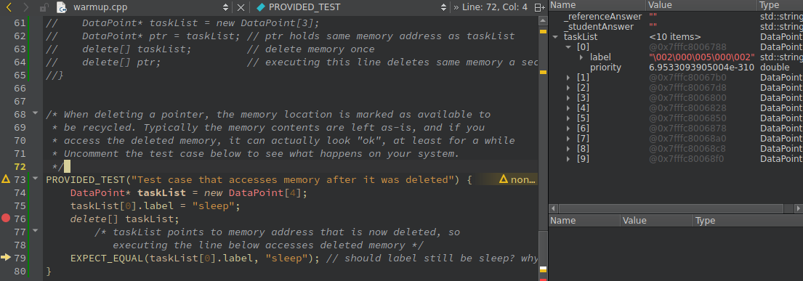

### 第二部分 基于数组的优先级队列

***5. Q5***

接口中的注释描述了功能及算法复杂度，而实现中的注释加入了更多实现细节的描述。

***6. Q6***

``_numAllocated``用于记录分配空间的个数，表示存储个数的上限。``_numFilled``用于存储当前实际占用的存储空间的个数。

***7. Q7***

这样可以降低变量被多个方法直接进行修改的可能性；调用已经封装的类操作方法可以增加函数的便捷性与可读性。

***8. Q8***

``PQArray::enqueue()``的时间复杂度为``O(N)``，由于``fillQueue()``在for循环中调用了``PQArray::enqueue()``，所以``fillQueue()``的时间复杂度为``O(N^2)``。``PQArray::dequeue()``的时间复杂度为``O(1)``，由于``emptyQueue``在for循环中调用了``PQArray::dequeue()``，所以``emptyQueue()``的时间复杂度为``O(N)``。运行时间测试截图如下

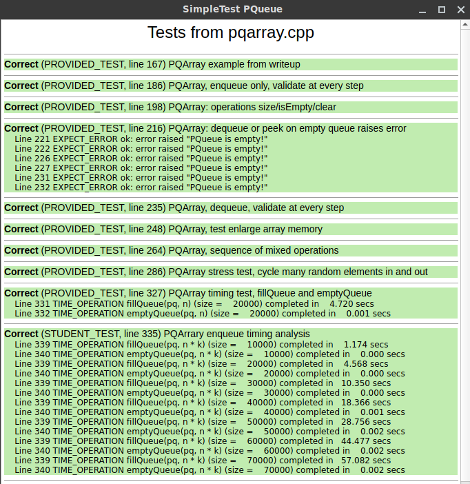

### 第三部分 使用优先级队列

***9. Q9***

如果基于 ``PQArray`` 实现，对 ``pqSort`` 的时间复杂度是``O(N^2)``。


***10. Q10***

基于``enqueue``和``dequeue``的时间复杂度，如果使用``PQArray``，``topK``的时间复杂度为``O(n*k)``，运行时间截图如下：

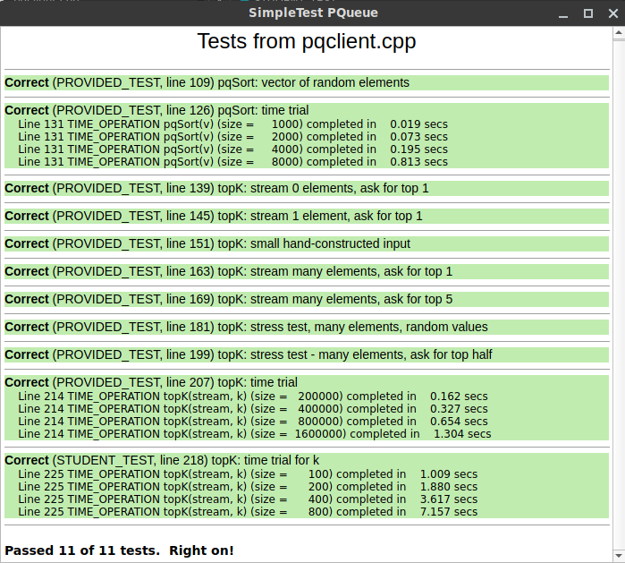

### 第四部分 基于二叉堆的优先级队列

***11. Q11***

二叉堆如下

```
                                      {"T",1}
                                         |
                      +------------------+-------------------+
                      |                                      |
                   {"B",3}                                {"G",2}
                      |                                      |
            +---------+---------+                   +--------+----------+
            |                   |                   |                   |
         {"S",6}             {"A",5}             {"V",9}             {"R",4}
            |
   +--------+---------+
   |                  |
{"O",8}            {"K",7}
```

***12. Q12***

经过2次出队操作后上述二叉堆如下

```
                               {"B",3}
                                  |
              +-------------------+-------------------+
              |                                       |
           {"A",5}                                 {"R",4}
              |                                       |
    +---------+----------+                 +----------+---------+
    |                    |                 |                    |
{"S",6}               {"O",8}            {"V",9}             {"K",7}

```

***13. Q13***

上面二叉堆的数组表示如下:

[0:{"B",3}, 1:{"A",5}, 2:{"R",4}, 3:{"S",6}, 4:{"O",8}, 5:{"V",9}, 6:{"K",7}]

***14. pqheap测试截图***

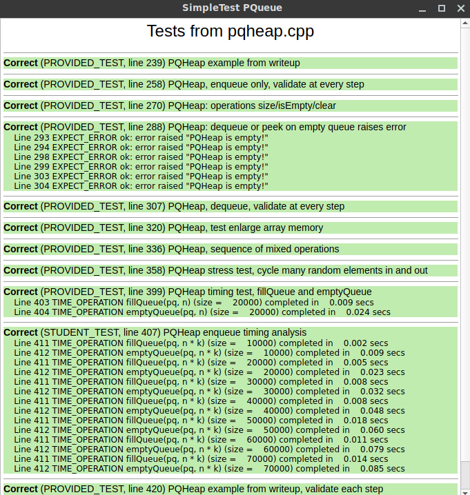

***14. Q14***

使用``PQHeap``在``pqclient.cpp``上重新运行计时试验，测试截图如下

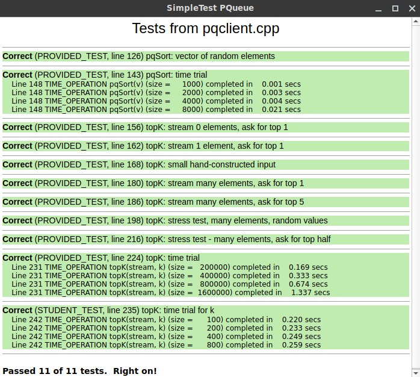

##  8. <a name='assign5'></a>assign5

### 第一部分 热身

***1. Q1***

测试用例的黄色背景在 ``SimpleTest`` 结果窗口中表示程序能够通过测试，但存在内存泄漏。

***2. Q2***

对已释放的内存地址使用 ``delete`` 的测试结果是报出以下错误：
```
*** STANFORD C++ LIBRARY
*** The Lists program has terminated unexpectedly (crashed)
*** An abort error (SIGABRT) was raised during program execution

    This error is raised by system functions that detect corrupt state

*** To get more information about a program crash,
*** run your program again under the debugger.
FATAL: exception not rethrown
```

***3. Q3***

在我的系统上，观察到 ``badDeallocate`` 的后果是：
```
free(): double free detected in tcache 2
```

***4. Q4***

我的系统上呈现的段错误如下：
```
*** STANFORD C++ LIBRARY
*** The Lists program has terminated unexpectedly (crashed)
*** A segmentation fault (SIGSEGV) occurred during program execution

    This error indicates your program attempted to dereference a pointer
    to an invalid memory address (possibly out of bounds, deallocated, nullptr, ...)

*** To get more information about a program crash,
*** run your program again under the debugger.

FATAL: exception not rethrown
```

### 第二部分 迷宫

***5. Q5***

其他收集所需物品的路径如下：
```
WNNEWSSEESNWSWWN
```

***6. labyrinth测试截图***

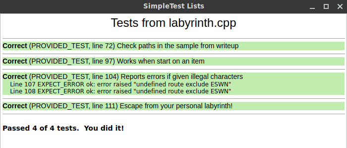

### 第三部分 链表排序

***7. Q6***

如果 ``deallocateList`` 函数是递归实现的，根据作业 3 中的热身练习可以粗略估计它可以成功处理的最大长度列表为261888。对于比最大值更长的列表，如果尝试收回内存，观察到的结果是当栈帧数超过系统上限时，程序会崩溃并停止。

***8. Q7***

指针本身需要通过引用传递，是由于``quickSort``函数需要对指针中存储的地址进行修改，如果不这样做，函数的调用时，指针通过值传递方式传参，但是函数的执行过程仅仅对本地的副本生效，另外指针指向的堆空间不能够得到释放，造成内存泄漏。

***9. Q8***

元素是随机情况下``quickSort``的运行时间结果如下，可以看到数据量翻倍，运行时间也近似是翻倍，所以程序复杂度近似是``O(NlogN)``。

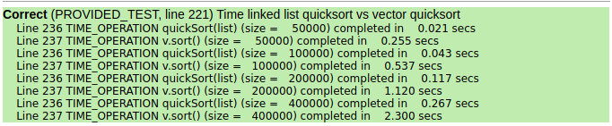

最坏情况的输入是链表中元素完全按照逆续排列， 最坏情况下``quickSort``的运行时间结果如下，可以看到数据量翻倍，运行时间近似是翻4倍，所以程序复杂度近似是``O(N^2)``。

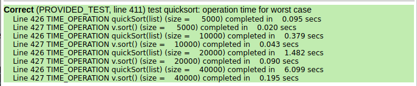

***10. sorting测试截图***

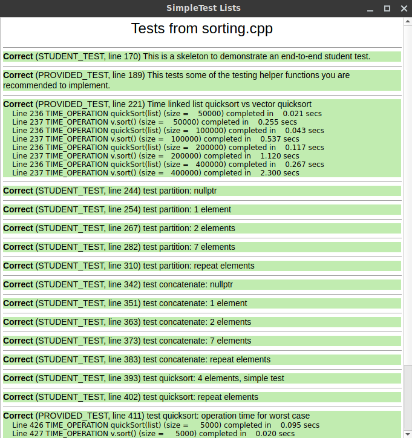